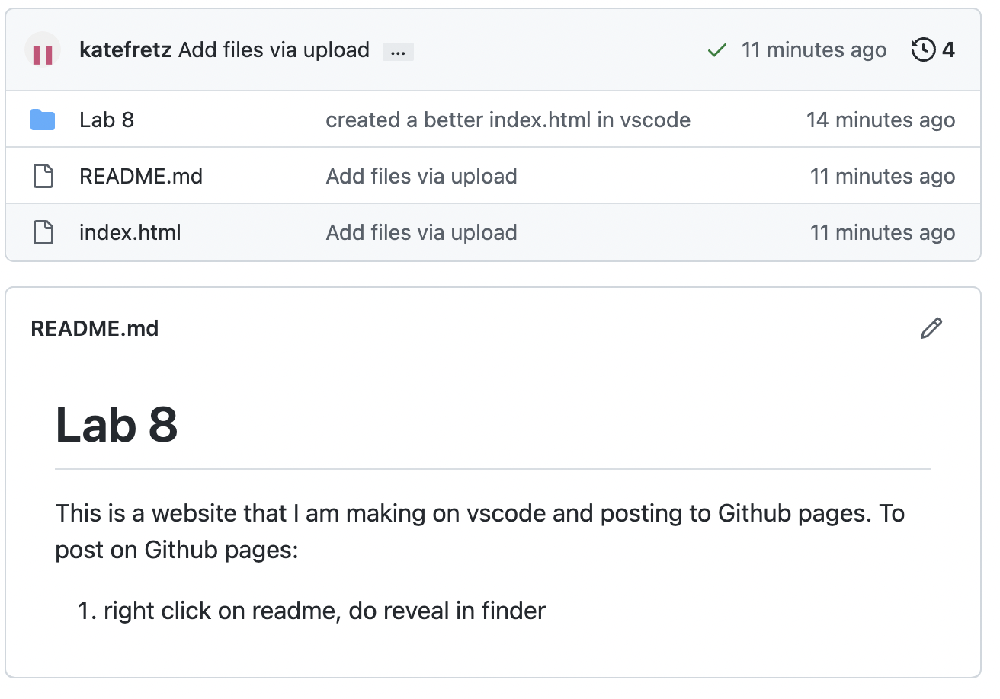

# Lab 8 

This is a website that I am making on vscode and posting to Github pages. To post on Github pages:

1. right click on readme, do reveal in finder 
2. On Github in your folder go to add file/

